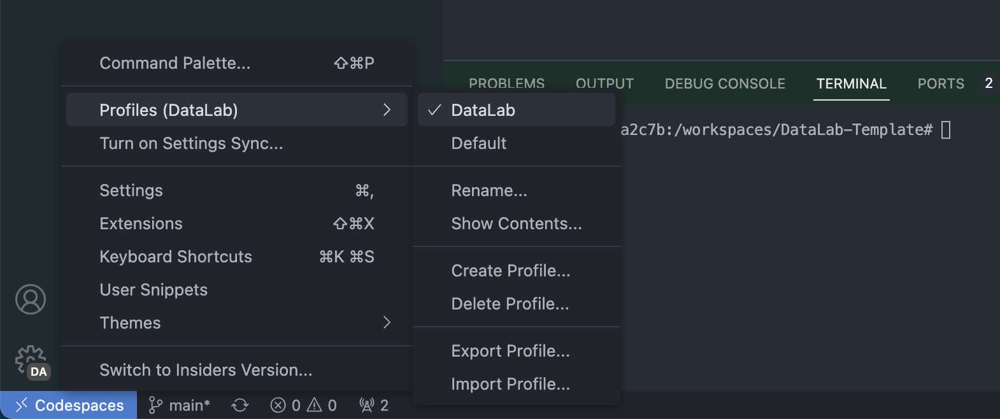

# Work Space with AI for futurist :butterfly:


This is a  :fire: __one-click__  :fire: solution to create a workspace with AI for futurist :airplane:. It assumes you have: 

- Github account :octocat:
- Github CodeSpace enabled (if not, register [here](https://github.com/features/codespaces))
- Github Copilot enabled (if not, register [here](https://github.com/features/copilot))

## Who is this for

- Futurist who wants to use AI to improve productivity
- Futurist who wants to use AI to improve creativity
- Students who wants to use AI to improve learning and research
- Students who wants to use AI to write thesis and paper
- Academic who wants to use AI to improve teaching and research


## How to use

1. Click the button below to create a new repository from this template

   []

2. Setup profile

   - Go to `Settings` -> `Profile` -> `Import profile` 
   - paste the following link to `Import profile` and click `Import`

   ```bash
   https://gist.github.com/oceanumeric/fea3f2a9d7457b53b9346e4c0f8df4b0
   ```

   Once imported, you should see the following profile:

   

3. Watch this video to learn how to use this template more effectively in _5 minutes_:

[Youtube Video](https://youtu.be/zc4JCyJL0_Q)

