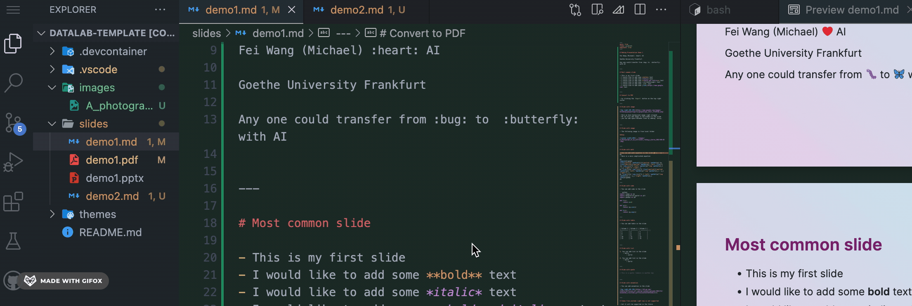

# Making Presentation Demo 1

Fei Wang (Michael) :heart: AI

Goethe University Frankfurt 

Any one could transfer from :bug: to  :butterfly: with AI


---

# Most common slide

- This is my first slide
- I would like to add some **bold** text
- I would like to add some *italic* text
- I would like to add some ***bold and italic*** text
- I would like to add some ~~strikethrough~~ text
- I would like to add some `code` text
- I would like to add some [link](https://www.google.com) text


---

# Convert to PDF

- by clicking the `Export` button on the top right corner



---

# Slide with image


- Here we have background image right aligned
- We can also add image in the middle of the slide
- you can add space between lines by adding `&nbsp;`


---

# Slide with image

- The following image is from local folder

&nbsp;


---

# Slide with math

- You can add math equation in the slide $f(x) = ax + b$
- Here is a more complicated equation

$$
\begin{aligned}
\frac{\partial \mathcal{L}}{\partial \mathbf{w}} &= \frac{\partial}{\partial \mathbf{w}} \left( \frac{1}{n} \sum_{i=1}^n \left( \mathbf{w}^\top \mathbf{x}_i - y_i \right)^2 \right) \\
&= \frac{1}{n} \sum_{i=1}^n \frac{\partial}{\partial \mathbf{w}} \left( \mathbf{w}^\top \mathbf{x}_i - y_i \right)^2 \\
&= \frac{1}{n} \sum_{i=1}^n 2 \left( \mathbf{w}^\top \mathbf{x}_i - y_i \right) \mathbf{x}_i
\end{aligned}
$$

---

# Slide with code

- You can add code in the slide

```python
import numpy as np
import matplotlib.pyplot as plt
import pandas as pd

def f(x):
    return x**2

def g(x):
    return np.sin(x)

def h(x):
    return np.exp(x)
```

---

# Slide with table

- You can add table in the slide


| Column 1 | Column 2 | Column 3 |
|:-------- | --------: | :--------: |
| 1        | 2        | 3        |
| 4        | 5        | 6        |
| 7        | 8        | 9        |
| 10       | 11       | 12       |
| 13       | 14       | 15       |


---

# Slide with list

1. You can add list in the slide
    - hello 
        - world

2. You can add list in the slide
    - hello 
        - world


---

# Slide with quote

> This is a quote: tommorw is another day


--- 

# Slide with animation

- You can add animation in the slide


--- 

# Video from youtube right now is not supported

- but it will be supported in the future

